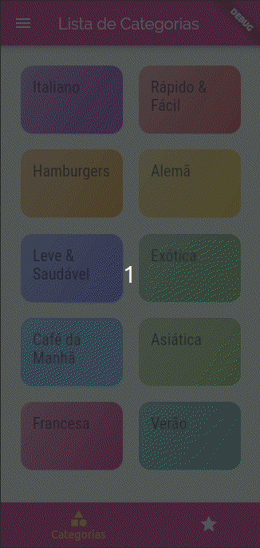

<h1 align="center">
 
  
 
 
Meals
</h1>

Some wonderful meals! You can favorite and customize the meals that are shown. :D

  

[//]: # (Add your gifs/images here:)

    
    

## Features
[//]: # (Add the features of your project here:)
This app features all the latest tools and practices in mobile development!

- **Flutter** — A open-source UI software development kit created by Google. It is used to develop applications for Android, iOS, Linux, Mac, Windows, Google Fuchsia, and the web from a single codebase. 

## Getting started

- git clone https://github.com/require64bits/expenses.git

- Open Project in your favorite IDE :)

## License

This project is licensed under the MIT License - see the [LICENSE](https://opensource.org/licenses/MIT) page for details.